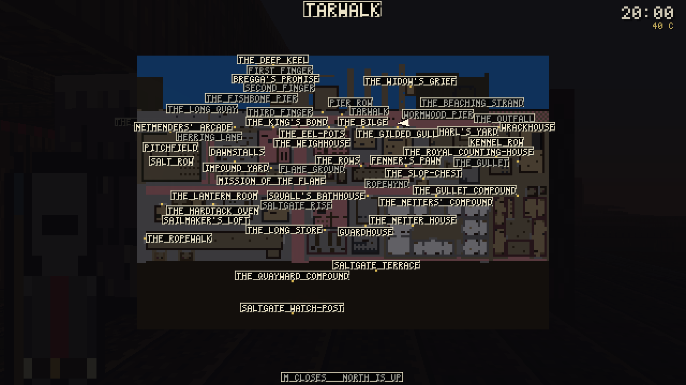

# PLAY.md — Granadad: The Darkstreets

How to start it, how to build a character, what topic/tone dialogue is, how
to find and finish a piece of faction work, and an honest account of what is
fun and what is not.

Written against `0.10.0`, commit `dc47aab` — the build that adds character
creation (Devin, Gabri, or your own) *wired into your actual playable
skills*, the "TELL ME ABOUT" topic tree, the district map, and the second
and third radiant-quest content packs.

---

## 0. `dist\granadad.exe` is current and gate-certified

As of this pass, `dist\GATE-STAMP.txt` reads 679 ctest cases (floor 537),
timestamped minutes ago — a genuine `docker compose run --rm --build build`
+ `scripts\verify-windows.ps1` green, not a cross-compile with `ctest`
skipped. The `native/tests/test_casebook.cpp:635` spawn-location bug that
blocked every publish earlier tonight is fixed (commit `1eaa12d`) and the
chargen-to-`SkillTrack` seam §2 used to have to caveat about is closed
(commit `dc47aab`) — both landed, both are in the binary in `dist\` right
now. Rebuild yourself any time with:

```
powershell -ExecutionPolicy Bypass -File .\scripts\gate.ps1
powershell -ExecutionPolicy Bypass -File .\scripts\verify-windows.ps1
```

(`gate.ps1` is `docker compose run --rm --build build` with the commit you are
on stamped into `dist\GATE-STAMP.txt`; the bare compose command works too and
stamps `unknown`.)

The screenshots in section 7 were captured earlier tonight from an
uncertified cross-compile of an in-progress commit (`369ae59`); every system
they show is unchanged since, but if you want frames from the exact
certified binary described above, they are one `--screenshot=` flag away —
see the repro commands at the end of §7.

---

## 1. Start it

```
.\dist\granadad.exe
```

No arguments, no launcher, no config file. It opens a window on the Docks of
Granadad at eight in the morning. **First frame is character creation**, not
the casebook — see §2.

**Sanity checks that need no window:**

```
.\dist\granadad.exe --selftest     # nine integer primitives, no display needed
.\dist\granadad.exe --version      # which binary you are holding
.\dist\granadad.exe --help         # every flag, and there are a lot of them
```

---

## 2. Character creation, start to finish

Five rows, one screen, UP/DOWN to move and ENTER to pick. The top three are
the Daggerfall flow's own doors — make your own; the bottom two are quick
starts:


**TAKE A CALLING** lists the ward's nine trades — Dockhand, Deckhand, Watch
Runner, Netter, Mudlark, Roof-Tenant, Almsbearer, Stallkeep, Copy-Clerk, each
a full pre-authored Primary/Major/Minor sheet out of
`content/raws/chargen/callings.json`, previewed whole in the middle of the
screen while you hover it:


**ANSWER FOR YOURSELF** is the ward's ten questions — second person, three
defensible answers each, answer order shuffled per question so the axes can't
be pattern-marked. Three identity meters (HAND / MUDLARK / DISCIPLE) fill as
answers land, and the hovered answer is always spelled out in full mid-screen:


Ten answers become a verdict card — the tally in the header, the offered
trade's whole sheet previewed under it. **The verdict is never a trap**:
`TAKE THE CALLING` or `ANOTHER TRADE`, which drops you on the roster to pick
by eye instead:


Either way you then answer for your past — **the twelve-question biography**
(`content/raws/chargen/biography.json`), each answer moving real levers:
skill deltas, the starting purse, faction standing (zero-sum, enforced at
load), seeded dispositions with named notables, starting heat, hpMax. The
first question also offers `A PAST AT RANDOM`, Daggerfall's own option:


All three doors converge on the same review screen with the result
pre-designated — and everything the sheet can't hold (coin, heat, standings,
seeds, hpMax) rides `CreationResult::effects` to the boot seam and is applied
once through the engine's own setters:


**DEVIN and GABRI are Eli's own BG3/Divinity: Original Sin 2-style origin
templates** — fixed, hand-authored characters, not something you spend points
on, and they skip the quiz and the biography entirely: their history is the
raws' own. Pick one and the next screen shows a real skill sheet pulled
straight out of `content/raws/companions/devin.json` or `gabri.json`,
read-only:


The top band says **"A FIXED SHEET — NOT ADJUSTABLE HERE"** the moment you
land on one, so trying LEFT/RIGHT on a row and having nothing move is not a
bug — you were told why before you tried. Devin is three Primary skills
(Sidearms, Skyrunning, Cracksmanship), three Major, six Minor, all citing a
line of the novel in `docs/lore/`. Gabri's sheet is the same shape, built for
a different read of the character (Bladework and Channeling where Devin has
none of either). Press `0` to page to the rest — the row list runs to twelve
skills plus four derived attributes.

**WALK YOUR OWN PATH is the point-bought path** — Daggerfall's own
Primary/Major/Minor sheet, for real, with the difficulty dagger's readout in
the status line (`DAGGER +0 PACE X1.00` — the Q8 advancement multiplier is
live in the sim; the advantage shop that would move it is priced in
`docs/design/CHARGEN-DAGGERFALL-DRAFT.md` §5 and awaits sign-off, so the
points stay honestly at zero):


`NAME` (type it — letters, spaces, hyphens, apostrophes, sixteen glyphs), then
`LOOK` (LEFT/RIGHT cycles eleven of the ward's own sprite types — the same
vocabulary the six hundred and fifty-odd bodies in the street are drawn out
of, so a custom Wielder is not a seventeenth kind of person the game invents
just for you), then one row per skill (LEFT/RIGHT steps
NONE → PRIMARY → MAJOR → MINOR → NONE, refused the instant a tier is full —
three Primary slots, three Major, six Minor, exactly like Devin and Gabri's
fixed sheets), then four attribute rows spending a shared point pool. `BEGIN`
is greyed until you have typed a name; it does **not** require every slot
filled, so you can start with an unfinished sheet on purpose. The first
`BEGIN` a make-your-own path presses routes through the biography once —
sheet, then your past, then back here to review, the doc's own order — and
the second one starts the game.

**What actually happens when you press BEGIN:** the game opens on the
Tarwalk with your name and your look, and **your built sheet now reaches
your actual playable skills** — `run_client()` writes `chosen.chargen.apply()`
/ `chosen.companion.applyStartingSkills()` straight into
`session.tavern().dialogue().skills()`, the one live `SkillTrack` every
mechanic in the build reads — and then applies your biography's effects,
once, through the engine's own public seams: the purse the barter verbs
move, direct faction-row seeds, `SocialLedger::seed` for the named notables
who already know you, starting heat, hpMax, and the dagger's Q8 multiplier
onto how fast every skill grinds. A Devin who took Cracksmanship at Primary
opens a lock measurably faster than one who never touched it, tonight, in
this build — not cosmetic. (Attribute points are the one thing left
uncrossed on purpose: nothing downstream reads them yet, so wiring them
would mean inventing a mechanic, not closing a seam.)

---

## 3. The first ten minutes

You are on the **Tarwalk**, looking west, the Gilded Gull on your left, the
harbour open on your right. It is eight in the morning and six hundred and
fifty-odd people are already at work — posts at the warehouses, appetites
that get worse as the day goes on, a Watch that changes shift at six. They
keep those hours whether you watch them or not.


**Every one of them will talk to you.** `E` on anybody standing in front of
you, anywhere in the district — not just the Gilded Gull's own cast.

The notes are open on your first frame:

> A BODY CAME UP AGAINST THE OUTFALL GRATE AT LOW TIDE.
> THE MISSION TOOK IT IN FOR RITES.
>
> `? THE BODY`

**Walk, and the notes put themselves away.** They never open again on their
own.

**WASD** moves, the **mouse** looks, **shift** sprints, **ctrl** crouches,
**space** jumps, **E** talks. **There is no climb key** — walk into a ledge
under about 2.7 m and you climb it, hands full, half a second of hauling.
`V` still lines up a deliberate climb or leap if you would rather aim one.

**Sprinting, climbing, swinging and casting all spend the same wind** — the
amber bar tucked under your health. It comes back while you are easy, slower
while you are walking, and faster as VIGOR and GRIT grow. Run it dry and the
sprint drops to a jog and the walls stop being climbable until you get your
breath back; a tired swing whiffs more and a tired link slips more. Your four
attributes finally do their work here: MIGHT lands harder, AGILITY moves and
climbs cheaper, VIGOR carries the pool, WIT steadies the cast and cools the
link sooner.

**And a held crafting now tunes them.** Cast *Steady the Hand*, *Set the
Shoulders* or *Clear the Head* and the point it lends is real for its whole
quarter-hour — cheaper climbs, a bigger pool, a sooner link — with its own
countdown row in the top-right stack. Recasting refreshes the clock; sleeping
runs it out. The warmth rows still refuse honestly: nothing in the ward reads
heat on a body yet, and a success toast over a no-op is a lie.

Nine verbs are the rest of the game, and the pad has the same nine (`docs/design/CONTROLS-SPEC.md` is the whole table):

| | |
|---|---|
| **`MOUSE1`** | **swing.** Hands down, one press brings them up and hits whoever is in front of you. Hold it to swing hard. `RT` on a pad. |
| **`MOUSE2`** | **guard.** Held. `LT` on a pad. |
| **`C`** | **cast** what the grimoire has readied. `RB` on a pad. |
| **`E`** | **use whatever is in reach.** Talk, open, lift, pick, rob, look, by your stance and what you face. Fists up and nothing in reach, it lowers them. `A` on a pad. |
| **`LCTRL`** | **sneak.** Tap or hold. `B` on a pad, and `B` backs out of every page. |
| **`SPACE`** | **jump.** `Y` on a pad. |
| **`LSHIFT`** | **run.** The stick does it on a pad. |
| **`J`** | **your notes.** The sheet, the chart (the *investigation's* map, with bearings from where you stand), the letters, the casebook. `[` and `]` page on past them to the ward map and the grimoire. `D-pad up` on a pad, `LB` `RB` to page. |
| **`ESC`** | **pause.** Resume, wait, controls, settings, quit. `START` on a pad. |
| **`M`** | **the ward map.** A full-screen top-down plan of the whole district. Your own position and facing are the light wedge. `M` or `ESC` closes it. On a pad it is a page of your notes, one `RB` past the casebook. |

The controls page (PAUSE, then CONTROLS) lists every key, and SETTINGS rebinds any of them, saved to `granadad-controls.cfg` beside the exe. `T` or `SELECT` opens the wait page straight off; the digits ready a quick slot; the wheel or `D-pad` left and right step the bar.

**The ward map, because the owner asked for it in as many words** — "It's
too difficult to locate places like the mission, let's give the player a map
that they can press M to see":



No discovery gating and no fog of war — the ward is home turf and the locals
know it, so everything signed is shown. Way names are the grey register, door
names the bone one, and door names place nearest-you-first, so the door you
are hunting is the one that keeps its label. The plan is drawn at *your* band
(one band down still reads, dimmed; the harbour always shows), so the same
key on a rooftop shows the roof-slum plane instead of the quay.

**Where to go first:** bottom-left reads `CASE 0/1 > MISSION OF THE FLAME`.
It always names the next place the trail wants you. Stand there and press
`Q`. Everything past that is the same investigation the last build had — the
Outfall dead end, the twelve-lead trail, the Gull's own sixteen and now the
whole street besides — and it still holds up; see §5.

---

## 4. Topic/tone dialogue: what it is and how to use it

`E` opens a conversation. What you get depends on who they are and the hour,
but the door into the deep end is the same for everyone: **`TELL ME
ABOUT...`**, always the first topic on the list.


Choose it and the list swaps for five branches — Daggerfall's own shape,
built new this morning:


**A PLACE / A PERSON / A THING** ask about a specific named landmark, body or
object and answer out of the most specific line the ward has for it — the
same person, asked the same question at four in the morning instead of noon,
answers differently, because the chain is
`<id>.<family>.<attitude>.<band>` down to the bare fact if nothing more
specific was authored. **THEIR WORK** is shop talk out of their own trade's
mastery table. **A QUEST** is a second, always-valid way to reach the same
casebook-linked topics the root list already carried before this tree
existed — asking here is not a shortcut, it is the identical entry point
asked a second way. **(BACK)** steps up one level; it never closes the
conversation, `SAY NO MORE` still owns that.

**One rough edge in this same screen, worth calling out directly:** topic
labels that overrun their column get hard-cut mid-word and a bare `.`
appended as a "there's more" mark — `clipLabel()` in
`native/src/render/dialogue_view.cpp`, a deliberate choice over a
word-boundary cut that was tried and threw away too much space. On screen it
reads as broken English rather than stylized shorthand: `THE VANISHED.`
(from THE VANISHED CLERK), `SIGN ON: THE.` (from SIGN ON: THE MISSION),
`PICK THEIR POCK.` (from PICK THEIR POCKET) — see the zoomed crop in
`docs/frames/p84-playthrough/30-zoom-topics.png`. It collides with the same
screen's own `TELL ME ABOUT...` ellipsis, so a real "more text" mark and a
"this word got cut off" mark currently look identical. The column-budget
logic can stay; the marker itself is the part worth revisiting.

**What "tone" is, and the honest state of it:** the Daggerfall reference
material this build is measured against has a POLITE / NORMAL / BLUNT
selector sitting beside the topic list, visibly changing what an NPC says
back. Granadad has the identical mechanic **in the simulation** —
`DialogueDirector::setTone()`/`tone()`, and `barks.json` lines can be
authored under a `.polite` or `.blunt` suffix that the register reads before
falling back to the normal line. **It has no key bound to it and no topic row
that reaches it.** I checked the controls table (`Action` enum,
`controls.cpp`), the client's key handling, and every test file that touches
`setTone()` — all of it is `native/tests/test_dialogue.cpp`, unit tests
against the sim layer directly. Nothing in `session.cpp` or `main.cpp`
calls it. So: the tone *engine* exists and is tested: the tone *dial* is not
in the game yet. If you go looking for it expecting a Daggerfall-style
toggle, you will not find one — that is a gap, not something you are missing.

---

## 5. Finding and finishing a piece of faction work

Here is the part of this file I have to walk back from how it was asked.
There are now **two** things in this codebase that could reasonably be
called "a radiant faction quest," and only one of them is a quest you can
actually go and do.

### What you actually can do tonight: the contract board

Three named people in the Gilded Gull hand out generated work, each tied to
a faction and priced by your standing with it — this is the system that has
been playable since S6 and is still the real thing to try:

- **Watchman Cull**, the impound keeper — `THE WARD'S BOUNTY`. Anybody can
  ask. Mostly scalps.
- **Master Venn**, on the stair — `THE HOUSE'S OWN WORK`. Needs the house to
  know you.
- **Finch**, in the snug after ten — `WORK OFF THE ROOFS`. Needs the
  Skyrunners to have sworn you in first.

Talk to whichever one will deal with you, choose **`ASK ABOUT WORK`**, take
what is offered, go get it (carry contraband, or just carry word), and come
back. A scalp bounty needs a priest's mark before Cull will pay it — find
Father Maell and choose **`SIGN FOR THE SACK`** (the `Sanction` topic)
first, then return to Cull to turn in and get paid.


I ran this whole loop with a scripted capture (`--contract=talk`) rather than
just reading the code: it took the job, delivered it, got paid — `open=4
taken=0 paid=1 lost=0 earned=12`. It works end to end, tonight, in this
build.

### What exists but you cannot reach: the radiant board

This morning's later commits (`ddaa368` through `369ae59`) built a second,
newer generator — `RadiantBoard`, `content/raws/quests/radiant_quests_flame.json`
and `radiant_quests_skyrunner.json` — and it is a genuinely bigger idea than
the contract board: instead of drawing from forty-two authored notables, it
draws its cast from the **whole live ward**, resolving where a body is
*actually standing right now* rather than a site baked into a raw file once.
Eleven templates, real fetch/deliver objectives, real names, real places, all
unit-tested (`test_radiant_quest.cpp`, `test_radiant_variety.cpp` — the
variety suite genuinely catches a rigged draw; I did not just trust it, a
sibling verification session mutated the draw to always pick index 0 and
watched those tests go red on it).

**None of it is wired to anything a player can press.** I grepped the whole
of `native/src` and `native/include` for `RadiantBoard`, `RadiantRaws` and
`RadiantObjective`: every hit is inside `radiant_quest.cpp`/`.hpp`
themselves. `session.cpp`, `session.hpp` and `main.cpp` never mention
"radiant" at all — no key, no topic, no HUD line. Even `--help`'s long list
of scripted-capture flags, which has one for literally every other system in
this build (`--flame`, `--roofs`, `--skyrun`, `--nemesis`, `--contract`,
`--burgle`, `--trail`), has no `--radiant`. It is a complete, tested engine
and content pack sitting on a shelf with no door built into the room it is
in. If you go looking for "Skyrunner contraband runs" or "the Mission's own
errands" in the actual game tonight, they are not there — the sentences are
written, the objectives resolve against real bodies, and nothing hands
either to a player.

---

## 6. What the corners of the screen mean

| Where | What |
|---|---|
| top centre | compass ribbon, and the place you are standing in |
| top right | the hour, your purse, what the ward thinks of you, what the Watch has heard, what is in your sack, and whether anybody can see you |
| bottom left | health, and `CASE N/M > ...` — where the trail stands |
| bottom right | the room you are in, and the man who last put you on the floor |
| bottom centre | the lock under your wire, and whatever was just said to you |

The centre of the screen stays empty with every one of the overlay pages up
— casebook, keys, options, pause, character, the new district map, creation
— that is a rule with a pixel-diff test behind it, not a preference.

---

## 7. Frames from this morning's build

All captured from the binary described in §0 — a real, uncached compile of
current source, played rather than described:

| | |
|---|---|
| `s10-11-morning.png` | the Tarwalk at eight, opening on the case |
| `s14-chargen-origin.png` | the five rows: three Daggerfall doors, two quick starts |
| `s14-chargen-calling.png` | the nine-trade roster, a whole sheet previewed |
| `s14-chargen-quiz.png` | question five, the meters mid-tally |
| `s14-chargen-verdict.png` | the tally's verdict card — take it, or another trade |
| `s14-chargen-background.png` | the biography, question four of twelve |
| `s14-chargen-review.png` | the convergence: a taken calling on the review screen |
| `s14-chargen-custom.png` | the point-bought sheet, with the dagger readout |
| `s10-14-chargen-devin.png` | Devin's fixed sheet, read-only, paged |
| `s10-15-topic-root.png` | a real street conversation — TELL ME ABOUT is topic 1 |
| `s10-16-topic-branches.png` | the five branches: place / person / thing / work / quest |
| `s10-17-contract-work.png` | Watchman Cull, ASK ABOUT WORK on the list |
| `s10-18-district-map.png` | the casebook's Chart tile — known ground, one open lead |
| `s14-ward-map.png` | the ward map: the whole district plan under `M`, names on ground |
| `s14-ward-map-midslope.png` | the same map read from Saltgate Rise, band 20 — the mid-slope ground emphasized, the harbour still shown |
| `s14-ward-map-facing-fp.png` | the facing proof, half one: standing on the Tarwalk spawn, compass reading N |
| `s14-ward-map-facing-map.png` | the facing proof, half two: the same stand on the map, wedge pointing up — NORTH IS UP |

Reproduce any of it:

```
.\dist\granadad.exe --creation=origin --screenshot=x.png
.\dist\granadad.exe --creation=quiz --screenshot=x.png       # also: calling,
                                    # verdict, background, review, customize,
                                    # devin, gabri
.\dist\granadad.exe --street=hand --time=8 --screenshot=x.png
.\dist\granadad.exe --contract=talk --screenshot=x.png
.\dist\granadad.exe --map --screenshot=x.png
.\dist\granadad.exe --map-overlay --screenshot=x.png
```

---

## 8. An honest assessment: what is fun, what is not yet, what to try first

### Try first

1. **Build a character.** Pick Devin, back out, pick Gabri, compare the two
   sheets — that's the fastest way to see the writing behind both templates.
   Then pick Custom and spend the points yourself.
2. **`E` a stranger on the street, then press `1` for TELL ME ABOUT.** Ask
   the same person about a place at eight in the morning, then find them
   again after dark and ask again. The line changes.
3. **Walk the trail** (§3) — it is still the best fifteen minutes in the
   build.
4. **Talk to Cull, then Finch, then Maell** — the one complete faction-work
   loop that actually exists right now (§5).
5. **Press `M`.** The whole district, top-down, with every signed door and
   way named on the ground — find the Mission of the Flame by reading the
   map, then walk there. (The *investigation's* map — bearings and ranges to
   open leads — is the Chart tile in your casebook, `J`.)

### What works

**Character creation is a real screen, not a stub.** Two fixed, well-cited
origin templates and a working point-buy path, all three drawn through the
same list widget the casebook and the map already use, so nothing about it
feels bolted on.

**The topic tree is the best new thing here.** Five branches, real
attitude/hour-sensitive answers, and it reuses the district's existing
authored voice rather than inventing a second one — a promise this build has
kept since S3 and keeps again.

**The trail, the Outfall dead end, the Gilded Gull, and the district's six
hundred and fifty-odd walking, working people** are everything the last
version of this file said they were. Nothing about them regressed.

**The contract board still works end to end** and is still the one place in
this build where "ask for work, do the work, get paid" is a complete loop.

### What is thin or missing

**The tone selector is vapor.** It is real code, real tests, and zero
reachability. If Eli specifically wants the Daggerfall-style POLITE/BLUNT
toggle, it needs one topic row or one key — the hard part (the register
itself, and authored `.polite`/`.blunt` lines) is already built.

**The radiant board is the same story, at a much bigger scale.** A whole
second quest generator, built against the live ward instead of forty-two
fixed names, fully tested, with zero way in. This is worth more attention
than the tone gap — it's a sprint's worth of engine work with nothing
downstream of it yet.

**Topic labels truncate mid-word** and read as typos rather than style — see
§4's callout. Small, but it lands squarely on "no shitty English anywhere,"
so it's worth a real fix, not a shrug.

**Interiors are still brown boxes**, the long game is still mostly a
scoreboard, there is still no combat screen and no starter dungeon — none of
that changed this morning; see the git history for the fuller list if you
want it.

### The honest verdict

The best new thing this morning is the topic tree — it is the first system
in a while that changes what NPCs say based on something other than "have
you done the quest yet," and it reuses everything this build already earned
rather than reinventing a UI for itself. Character creation is a genuine,
well-written front door.

The thing to be careful of is the gap between "built" and "playable." Two
real systems — tone, and the whole radiant board — exist, are tested, and
currently do nothing for a player holding a keyboard. That is not a
criticism of the work; both are exactly as far along as an engine layer is
supposed to get before its interface. It is a note for whoever plans the
next session: the wiring is the next job, not more content.
