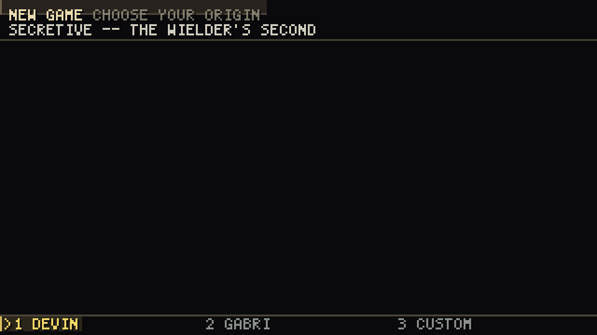
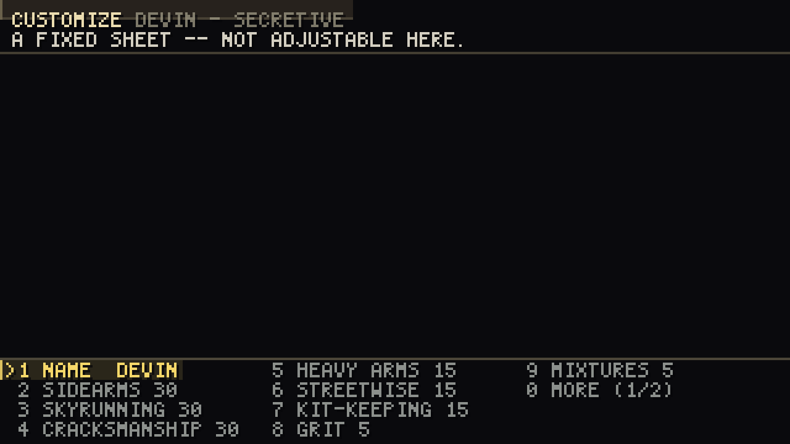
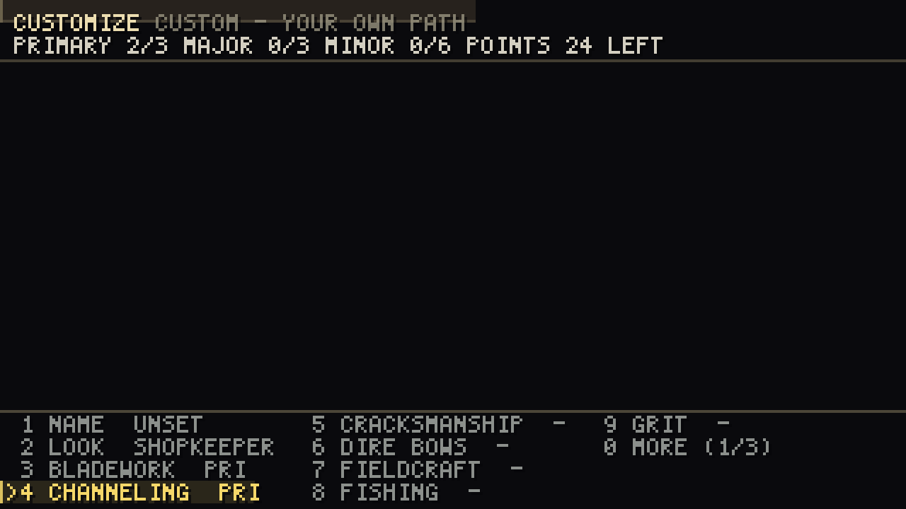
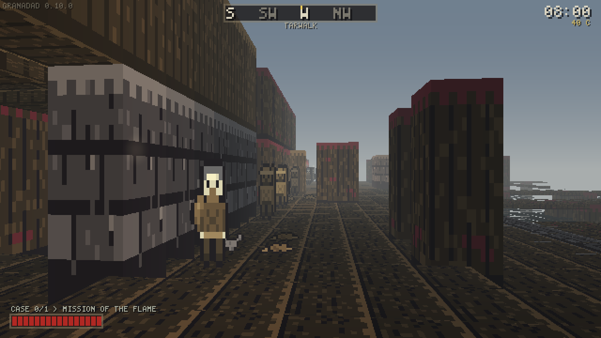
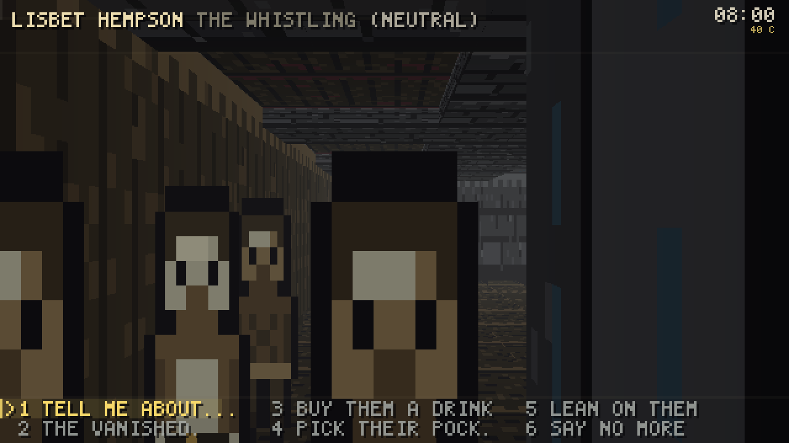
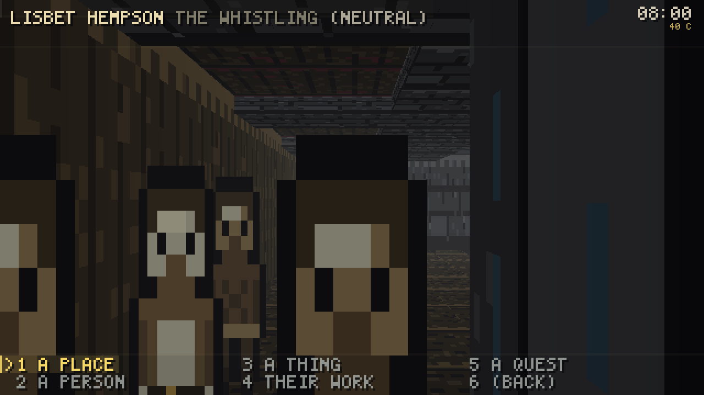
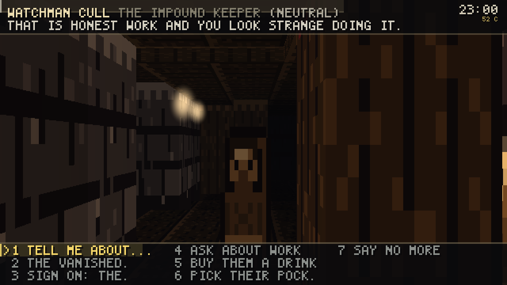

# PLAY.md — Granadad: The Darkstreets

How to start it, how to build a character, what topic/tone dialogue is, how
to find and finish a piece of faction work, and an honest account of what is
fun and what is not.

Written against `0.10.0`, commit `dc47aab` — the build that adds character
creation (Devin, Gabri, or your own) *wired into your actual playable
skills*, the "TELL ME ABOUT" topic tree, the district map, and the second
and third radiant-quest content packs.

---

## 0. `dist\granadad.exe` is current and gate-certified

As of this pass, `dist\GATE-STAMP.txt` reads 679 ctest cases (floor 537),
timestamped minutes ago — a genuine `docker compose run --rm --build build`
+ `scripts\verify-windows.ps1` green, not a cross-compile with `ctest`
skipped. The `native/tests/test_casebook.cpp:635` spawn-location bug that
blocked every publish earlier tonight is fixed (commit `1eaa12d`) and the
chargen-to-`SkillTrack` seam §2 used to have to caveat about is closed
(commit `dc47aab`) — both landed, both are in the binary in `dist\` right
now. Rebuild yourself any time with:

```
docker compose run --rm --build build
powershell -ExecutionPolicy Bypass -File .\scripts\verify-windows.ps1
```

The screenshots in section 7 were captured earlier tonight from an
uncertified cross-compile of an in-progress commit (`369ae59`); every system
they show is unchanged since, but if you want frames from the exact
certified binary described above, they are one `--screenshot=` flag away —
see the repro commands at the end of §7.

---

## 1. Start it

```
.\dist\granadad.exe
```

No arguments, no launcher, no config file. It opens a window on the Docks of
Granadad at eight in the morning. **First frame is character creation**, not
the casebook — see §2.

**Sanity checks that need no window:**

```
.\dist\granadad.exe --selftest     # nine integer primitives, no display needed
.\dist\granadad.exe --version      # which binary you are holding
.\dist\granadad.exe --help         # every flag, and there are a lot of them
```

---

## 2. Character creation, start to finish

Three doors, one screen, LEFT/RIGHT to move between the cards and ENTER to
pick one:



**DEVIN and GABRI are Eli's own BG3/Divinity: Original Sin 2-style origin
templates** — fixed, hand-authored characters, not something you spend points
on. Pick one and the next screen shows a real skill sheet pulled straight out
of `content/raws/companions/devin.json` or `gabri.json`, read-only:



The top band says **"A FIXED SHEET — NOT ADJUSTABLE HERE"** the moment you
land on one, so trying LEFT/RIGHT on a row and having nothing move is not a
bug — you were told why before you tried. Devin is three Primary skills
(Sidearms, Skyrunning, Cracksmanship), three Major, six Minor, all citing a
line of the novel in `docs/lore/`. Gabri's sheet is the same shape, built for
a different read of the character (Bladework and Channeling where Devin has
none of either). Press `0` to page to the rest — the row list runs to twelve
skills plus four derived attributes.

**CUSTOM is the point-bought path** — Daggerfall's own Primary/Major/Minor
sheet, for real:



`NAME` (type it — letters, spaces, hyphens, apostrophes, sixteen glyphs), then
`LOOK` (LEFT/RIGHT cycles eleven of the ward's own sprite types — the same
vocabulary the six hundred and fifty-odd bodies in the street are drawn out
of, so a custom Wielder is not a seventeenth kind of person the game invents
just for you), then one row per skill (LEFT/RIGHT steps
NONE → PRIMARY → MAJOR → MINOR → NONE, refused the instant a tier is full —
three Primary slots, three Major, six Minor, exactly like Devin and Gabri's
fixed sheets), then four attribute rows spending a shared point pool. `BEGIN`
is greyed until you have typed a name; it does **not** require every slot
filled, so you can start with an unfinished sheet on purpose.

**What actually happens when you press BEGIN:** the game opens on the
Tarwalk with your name and your look, and **your built sheet now reaches
your actual playable skills** — `run_client()` writes `chosen.chargen.apply()`
/ `chosen.companion.applyStartingSkills()` straight into
`session.tavern().dialogue().skills()`, the one live `SkillTrack` every
mechanic in the build reads. A Devin who took Cracksmanship at Primary opens
a lock measurably faster than one who never touched it, tonight, in this
build — not cosmetic. (Attribute points are the one thing left uncrossed on
purpose: nothing downstream reads them yet, so wiring them would mean
inventing a mechanic, not closing a seam.)

---

## 3. The first ten minutes

You are on the **Tarwalk**, looking west, the Gilded Gull on your left, the
harbour open on your right. It is eight in the morning and six hundred and
fifty-odd people are already at work — posts at the warehouses, appetites
that get worse as the day goes on, a Watch that changes shift at six. They
keep those hours whether you watch them or not.



**Every one of them will talk to you.** `E` on anybody standing in front of
you, anywhere in the district — not just the Gilded Gull's own cast.

The notes are open on your first frame:

> A BODY CAME UP AGAINST THE OUTFALL GRATE AT LOW TIDE.
> THE MISSION TOOK IT IN FOR RITES.
>
> `? THE BODY`

**Walk, and the notes put themselves away.** They never open again on their
own.

**WASD** moves, the **mouse** looks, **shift** sprints, **ctrl** crouches,
**space** jumps, **E** talks. **There is no climb key** — walk into a ledge
under about 2.7 m and you climb it, hands full, half a second of hauling.
`V` still lines up a deliberate climb or leap if you would rather aim one.

Four keys are the rest of the game:

| | |
|---|---|
| **`Q`** | **look at what is here.** The investigation verb. |
| **`E`** | **talk to whoever is in front of you.** Anyone, anywhere. |
| **`J`** or **`TAB`** | **your casebook.** |
| **`M`** | **the district map.** Known ground, open leads with a bearing from where you are actually standing, and who among the named will talk to you. New this morning. |
| **`C`** | **your character sheet.** |
| **`F1`** | **every key**, in the game, paged. |

`F2` rebinds any of them, saved to `granadad-controls.cfg` beside the exe.

**Where to go first:** bottom-left reads `CASE 0/1 > MISSION OF THE FLAME`.
It always names the next place the trail wants you. Stand there and press
`Q`. Everything past that is the same investigation the last build had — the
Outfall dead end, the twelve-lead trail, the Gull's own sixteen and now the
whole street besides — and it still holds up; see §5.

---

## 4. Topic/tone dialogue: what it is and how to use it

`E` opens a conversation. What you get depends on who they are and the hour,
but the door into the deep end is the same for everyone: **`TELL ME
ABOUT...`**, always the first topic on the list.



Choose it and the list swaps for five branches — Daggerfall's own shape,
built new this morning:



**A PLACE / A PERSON / A THING** ask about a specific named landmark, body or
object and answer out of the most specific line the ward has for it — the
same person, asked the same question at four in the morning instead of noon,
answers differently, because the chain is
`<id>.<family>.<attitude>.<band>` down to the bare fact if nothing more
specific was authored. **THEIR WORK** is shop talk out of their own trade's
mastery table. **A QUEST** is a second, always-valid way to reach the same
casebook-linked topics the root list already carried before this tree
existed — asking here is not a shortcut, it is the identical entry point
asked a second way. **(BACK)** steps up one level; it never closes the
conversation, `SAY NO MORE` still owns that.

**One rough edge in this same screen, worth calling out directly:** topic
labels that overrun their column get hard-cut mid-word and a bare `.`
appended as a "there's more" mark — `clipLabel()` in
`native/src/render/dialogue_view.cpp`, a deliberate choice over a
word-boundary cut that was tried and threw away too much space. On screen it
reads as broken English rather than stylized shorthand: `THE VANISHED.`
(from THE VANISHED CLERK), `SIGN ON: THE.` (from SIGN ON: THE MISSION),
`PICK THEIR POCK.` (from PICK THEIR POCKET) — see the zoomed crop in
`docs/frames/p84-playthrough/30-zoom-topics.png`. It collides with the same
screen's own `TELL ME ABOUT...` ellipsis, so a real "more text" mark and a
"this word got cut off" mark currently look identical. The column-budget
logic can stay; the marker itself is the part worth revisiting.

**What "tone" is, and the honest state of it:** the Daggerfall reference
material this build is measured against has a POLITE / NORMAL / BLUNT
selector sitting beside the topic list, visibly changing what an NPC says
back. Granadad has the identical mechanic **in the simulation** —
`DialogueDirector::setTone()`/`tone()`, and `barks.json` lines can be
authored under a `.polite` or `.blunt` suffix that the register reads before
falling back to the normal line. **It has no key bound to it and no topic row
that reaches it.** I checked the controls table (`Action` enum,
`controls.cpp`), the client's key handling, and every test file that touches
`setTone()` — all of it is `native/tests/test_dialogue.cpp`, unit tests
against the sim layer directly. Nothing in `session.cpp` or `main.cpp`
calls it. So: the tone *engine* exists and is tested: the tone *dial* is not
in the game yet. If you go looking for it expecting a Daggerfall-style
toggle, you will not find one — that is a gap, not something you are missing.

---

## 5. Finding and finishing a piece of faction work

Here is the part of this file I have to walk back from how it was asked.
There are now **two** things in this codebase that could reasonably be
called "a radiant faction quest," and only one of them is a quest you can
actually go and do.

### What you actually can do tonight: the contract board

Three named people in the Gilded Gull hand out generated work, each tied to
a faction and priced by your standing with it — this is the system that has
been playable since S6 and is still the real thing to try:

- **Watchman Cull**, the impound keeper — `THE WARD'S BOUNTY`. Anybody can
  ask. Mostly scalps.
- **Master Venn**, on the stair — `THE HOUSE'S OWN WORK`. Needs the house to
  know you.
- **Finch**, in the snug after ten — `WORK OFF THE ROOFS`. Needs the
  Skyrunners to have sworn you in first.

Talk to whichever one will deal with you, choose **`ASK ABOUT WORK`**, take
what is offered, go get it (carry contraband, or just carry word), and come
back. A scalp bounty needs a priest's mark before Cull will pay it — find
Father Maell and choose **`SIGN FOR THE SACK`** (the `Sanction` topic)
first, then return to Cull to turn in and get paid.



I ran this whole loop with a scripted capture (`--contract=talk`) rather than
just reading the code: it took the job, delivered it, got paid — `open=4
taken=0 paid=1 lost=0 earned=12`. It works end to end, tonight, in this
build.

### What exists but you cannot reach: the radiant board

This morning's later commits (`ddaa368` through `369ae59`) built a second,
newer generator — `RadiantBoard`, `content/raws/quests/radiant_quests_flame.json`
and `radiant_quests_skyrunner.json` — and it is a genuinely bigger idea than
the contract board: instead of drawing from forty-two authored notables, it
draws its cast from the **whole live ward**, resolving where a body is
*actually standing right now* rather than a site baked into a raw file once.
Eleven templates, real fetch/deliver objectives, real names, real places, all
unit-tested (`test_radiant_quest.cpp`, `test_radiant_variety.cpp` — the
variety suite genuinely catches a rigged draw; I did not just trust it, a
sibling verification session mutated the draw to always pick index 0 and
watched those tests go red on it).

**None of it is wired to anything a player can press.** I grepped the whole
of `native/src` and `native/include` for `RadiantBoard`, `RadiantRaws` and
`RadiantObjective`: every hit is inside `radiant_quest.cpp`/`.hpp`
themselves. `session.cpp`, `session.hpp` and `main.cpp` never mention
"radiant" at all — no key, no topic, no HUD line. Even `--help`'s long list
of scripted-capture flags, which has one for literally every other system in
this build (`--flame`, `--roofs`, `--skyrun`, `--nemesis`, `--contract`,
`--burgle`, `--trail`), has no `--radiant`. It is a complete, tested engine
and content pack sitting on a shelf with no door built into the room it is
in. If you go looking for "Skyrunner contraband runs" or "the Mission's own
errands" in the actual game tonight, they are not there — the sentences are
written, the objectives resolve against real bodies, and nothing hands
either to a player.

---

## 6. What the corners of the screen mean

| Where | What |
|---|---|
| top centre | compass ribbon, and the place you are standing in |
| top right | the hour, your purse, what the ward thinks of you, what the Watch has heard, what is in your sack, and whether anybody can see you |
| bottom left | health, and `CASE N/M > ...` — where the trail stands |
| bottom right | the room you are in, and the man who last put you on the floor |
| bottom centre | the lock under your wire, and whatever was just said to you |

The centre of the screen stays empty with every one of the overlay pages up
— casebook, keys, options, pause, character, the new district map, creation
— that is a rule with a pixel-diff test behind it, not a preference.

---

## 7. Frames from this morning's build

All captured from the binary described in §0 — a real, uncached compile of
current source, played rather than described:

| | |
|---|---|
| `s10-11-morning.png` | the Tarwalk at eight, opening on the case |
| `s10-12-chargen-origin.png` | choose your origin: Devin, Gabri, Custom |
| `s10-13-chargen-custom.png` | the point-bought sheet, a LOOK row over the ward's own vocabulary |
| `s10-14-chargen-devin.png` | Devin's fixed sheet, read-only, paged |
| `s10-15-topic-root.png` | a real street conversation — TELL ME ABOUT is topic 1 |
| `s10-16-topic-branches.png` | the five branches: place / person / thing / work / quest |
| `s10-17-contract-work.png` | Watchman Cull, ASK ABOUT WORK on the list |
| `s10-18-district-map.png` | the new district map — known ground, one open lead |

Reproduce any of it:

```
.\dist\granadad.exe --creation=devin --screenshot=x.png
.\dist\granadad.exe --street=hand --time=8 --screenshot=x.png
.\dist\granadad.exe --contract=talk --screenshot=x.png
.\dist\granadad.exe --map --screenshot=x.png
```

---

## 8. An honest assessment: what is fun, what is not yet, what to try first

### Try first

1. **Build a character.** Pick Devin, back out, pick Gabri, compare the two
   sheets — that's the fastest way to see the writing behind both templates.
   Then pick Custom and spend the points yourself.
2. **`E` a stranger on the street, then press `1` for TELL ME ABOUT.** Ask
   the same person about a place at eight in the morning, then find them
   again after dark and ask again. The line changes.
3. **Walk the trail** (§3) — it is still the best fifteen minutes in the
   build.
4. **Talk to Cull, then Finch, then Maell** — the one complete faction-work
   loop that actually exists right now (§5).
5. **Press `M`.** It is one keystroke old and it is a genuinely useful map,
   not a gimmick — a bearing and a range to every open lead from wherever you
   are actually standing.

### What works

**Character creation is a real screen, not a stub.** Two fixed, well-cited
origin templates and a working point-buy path, all three drawn through the
same list widget the casebook and the map already use, so nothing about it
feels bolted on.

**The topic tree is the best new thing here.** Five branches, real
attitude/hour-sensitive answers, and it reuses the district's existing
authored voice rather than inventing a second one — a promise this build has
kept since S3 and keeps again.

**The trail, the Outfall dead end, the Gilded Gull, and the district's six
hundred and fifty-odd walking, working people** are everything the last
version of this file said they were. Nothing about them regressed.

**The contract board still works end to end** and is still the one place in
this build where "ask for work, do the work, get paid" is a complete loop.

### What is thin or missing

**The tone selector is vapor.** It is real code, real tests, and zero
reachability. If Eli specifically wants the Daggerfall-style POLITE/BLUNT
toggle, it needs one topic row or one key — the hard part (the register
itself, and authored `.polite`/`.blunt` lines) is already built.

**The radiant board is the same story, at a much bigger scale.** A whole
second quest generator, built against the live ward instead of forty-two
fixed names, fully tested, with zero way in. This is worth more attention
than the tone gap — it's a sprint's worth of engine work with nothing
downstream of it yet.

**Topic labels truncate mid-word** and read as typos rather than style — see
§4's callout. Small, but it lands squarely on "no shitty English anywhere,"
so it's worth a real fix, not a shrug.

**Interiors are still brown boxes**, the long game is still mostly a
scoreboard, there is still no combat screen and no starter dungeon — none of
that changed this morning; see the git history for the fuller list if you
want it.

### The honest verdict

The best new thing this morning is the topic tree — it is the first system
in a while that changes what NPCs say based on something other than "have
you done the quest yet," and it reuses everything this build already earned
rather than reinventing a UI for itself. Character creation is a genuine,
well-written front door.

The thing to be careful of is the gap between "built" and "playable." Two
real systems — tone, and the whole radiant board — exist, are tested, and
currently do nothing for a player holding a keyboard. That is not a
criticism of the work; both are exactly as far along as an engine layer is
supposed to get before its interface. It is a note for whoever plans the
next session: the wiring is the next job, not more content.
